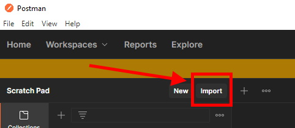
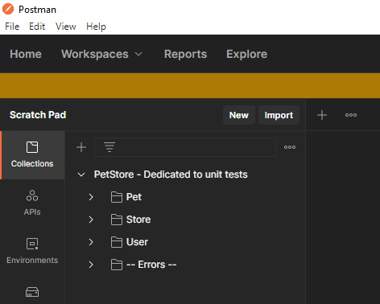
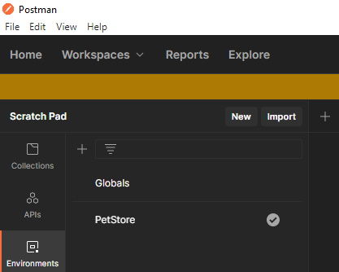
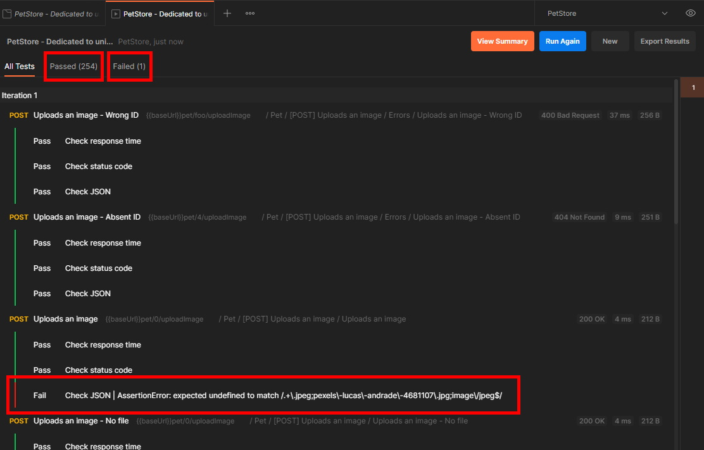
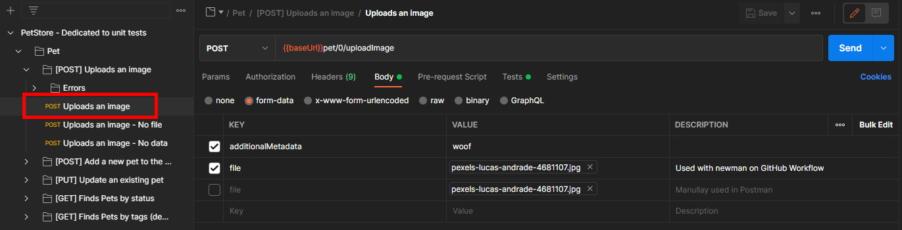
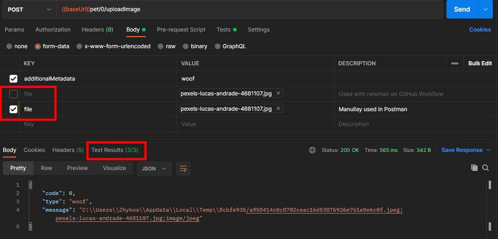

<p align="center">
  
  <h3 align="center">OpenAPI Generator</h3>
  <h2 align="center">🦖 Serveur Deno oak 🌳</h2>
  <br />
  <p align="center">
    <i>Implémentation d'un générateur OpenAPI pour produire un serveur backend basé sur Deno et le middleware oak</i>
    <br />
    <a href="https://github.com/Zhykos/deno-server-openapi-generator/blob/main/README.md"><strong>&raquo; English documentation &laquo;</strong></a>
    <br />
    <br />
    <a href="https://github.com/Zhykos/deno-server-openapi-generator/issues">Reporter un bug</a>
    ·
    <a href="https://github.com/Zhykos/deno-server-openapi-generator/issues">Proposer une évolution</a>
  </p>
</p>
<br />

[![Workflow][workflow-shield]][workflow-url]
[![License][license-shield]][license-url]
[![Issues][issues-shield]][issues-url]
[![Stable release][release-stable-shield]][release-url]

## Table des matières

- [À propos du projet](#à-propos-du-projet)
- [Générer le code d'un serveur basé sur Deno et oak](#générer-le-code-dun-serveur-basé-sur-deno-et-oak)
- [Lancer un serveur Deno oak généré](#lancer-un-serveur-deno-oak-généré)
- [Architecture du code généré](#architecture-du-code-généré)
- [Utiliser un autre middleware que oak](#utiliser-un-autre-middleware-que-oak)
- [Feuille de route](#feuille-de-route)
- [Contribuer au projet](#contribuer-au-projet)
	- [Créer le JAR de génération](#créer-le-jar-de-génération)
	- [Générer le PetStore](#générer-le-petstore)
	- [Envoyer votre contribution](#envoyer-votre-contribution)
- [Licence](#licence)
- [Contact](#contact)

## À propos du projet

**Deno oak OpenAPI Generator** vous permet de générer un serveur auto-configuré, basé sur <a href="https://deno.land">Deno</a> et le middleware <a href="https://github.com/oakserver/oak">oak</a>, à partir d'une spécification <a href="https://swagger.io/specification/">OpenAPI</a>.

Projet basé sur <a href="https://github.com/OpenAPITools/openapi-generator">OpenAPI Generator</a> version 5.4.

### Contexte personnel

J'ai eu envie d'apprendre TypeScript et Deno, deux technologies que je trouve intéressantes. C'est au détour d'un projet professionnel que j'ai encore découvert des projets avec une API mais où le code est totalement écrit à la main (dans un contexte Spring). Pour moi, les projets devraient toujours définir ses API via OpenAPI, puis générer le code. C'est via ce simple contexte et ma volonté d'apprendre que j'ai mixé Deno, oak, TypeScript et OpenAPI Generator pour créer ce projet.

## Générer le code d'un serveur basé sur Deno et oak

### Prérequis

Java version 11 : à récupérer sur le site de l'<a href="https://openjdk.java.net/projects/jdk/11/">OpenJDK</a>, mais vous pouvez prendre une autre implémentation.

### Téléchargement

Vous devez récupérer une version du générateur sur votre machine pour l'utiliser :
voir les _Releases_ dans
<a href="https://github.com/Zhykos/deno-server-openapi-generator/releases">GitHub</a>.

Télécharger alors un fichier ***openapi-generator-cli.jar*** dans la version que vous souhaitez (la plus récente est bien sûr recommandée). Vous pouvez vérifier l'authenticité du fichier grâce au <a href="https://fr.wikipedia.org/wiki/SHA-2#SHA-256">hash SHA-256</a> fourni dans un fichier à côté.

### Génération

*Aide basée de la documentation officielle <a href="https://github.com/OpenAPITools/openapi-generator">OpenAPI Generator</a>. Pour plus d'informations, n'hésitez pas à lire cette page.*

Après avoir téléchargé le fichier JAR, vous pouvez lancer la commande `java -jar openapi-generator-cli.jar help` pour prendre connaissance des options de lancement.

Exemple pour générer l'exemple ***PetStore*** proposé par <a href="https://petstore.swagger.io">OpenAPI</a> :
```
mkdir petstore-server-deno-oak/
java -jar openapi-generator-cli.jar generate \
  -i https://petstore.swagger.io/v2/swagger.json \
  -g deno-oak \
  -o petstore-server-deno-oak/
```

Adaptez bien sûr les chemins du JAR et du dossier cible de la génération (précisé par l'option `-o`) selon vos besoins.

## Lancer un serveur Deno oak généré

### Prérequis

Deno : à récupérer sur le <a href="https://deno.land">site officiel</a>.

### Implémentation du code nécessaire et obligatoire

#### Les services

Cette section est plus détaillée dans le paragraphe lié à l'architecture du code générée, mais dans un premier temps, vous avez juste à savoir que chaque mot clé (*tag*) du fichier de description OpenAPI permet de définir un service, c'est une façon de ranger le métier en groupes logiques.

Ainsi une interface est générée par regroupement et il vous faudra implémenter ces services. Vous les trouverez dans le dossier `services` généré.

L'exemple du ***PetStore*** génère trois services :

```
$ ls -l services/ --hide=*Private*
total 12
-rwxr-xr-x 1 Zhykos Aucun 2079 22 mars  19:26 PetService.ts
-rwxr-xr-x 1 Zhykos Aucun 1011 22 mars  19:26 StoreService.ts
-rwxr-xr-x 1 Zhykos Aucun 1740 22 mars  19:26 UserService.ts
```

Chaque service a alors plusieurs méthodes à implémenter correspondant à ce qui a été décrit dans le fichier OpenAPI. Reportez vous au <a href="https://petstore.swagger.io">site contenant l'exemple</a> si vous voulez plus de détails.

Vous pouvez également découvrir ces mêmes services que j'ai implémentés pour des besoins de tests unitaires, sur le dépôt <a href="https://github.com/Zhykos/deno-server-openapi-generator/tree/main/samples/server/petstore/deno/oak/tests/petstore">GitHub</a> du projet.

#### Initialisation et lancement du serveur

Une fois que vos services ont été codés, vous pourrez les fournir à la méthode d'initialisation et de démarrage du serveur Deno oak. Vous devrez également fournir le port d'écoute du serveur.

Voici un exemple avec les trois services implémentés et un serveur sur le port 3000 :

```typescript
import { DenoOakServer } from "./DenoOakServer.ts";
import { MyPetService } from "./MyPetService.ts";
import { MyStoreService } from "./MyStoreService.ts";
import { MyUserService } from "./MyUserService.ts";

const myPetService = new MyPetService();
const myStoreService = new MyStoreService();
const myUserService = new MyUserService();

new DenoOakServer(3000, myPetService, myStoreService, myUserService).start();
```

Vous pouvez ensuite lancer le serveur avec la ligne de commande suivante (à adapter en fonction du nom du fichier et des <a href="https://deno.land/manual/getting_started/permissions">options de sécurité Deno</a>) :

```
deno run --allow-net MyDenoOakServer.ts
```

## Architecture du code généré

La principale différence par rapport aux autres projets de génération est que j'ai souhaité que le code généré ne soit jamais modifié par les développeurs (en dehors des modifications des templates de génération, bien sûr).

Ainsi le constructeur de la classe `DenoOakServer` prend en paramètres tous les services à implémenter dans le cadre de votre projet. Ce n'est pas parfait, surtout si vous avez beaucoup de services, mais c'est une solution que j'ai trouvée acceptable dans le cadre d'une première version.

Le code est découpé en services et contrôleurs. Les services correspondent au code que vous devez implémenter : vous récupérer les informations passés par le client web, puis vous lui répondez en fonction de ce qui a été déclaré dans votre fichier OpenAPI. Les contrôleurs (dans le dossier `controllers`) permettent d'interpréter les informations qui circulent sur le réseau (dans l'URL, dans l'entête de la requête HTTP, etc.) pour les passer aux services.

Des services privés et internes sont également présents afin d'avoir une couche intermédiaire de gestion des paramètres issus des contrôleurs. Ce n'est pas parfait, mais c'est aussi acceptable pour une première version.

Enfin, il faut avoir en tête que le projet a d'abord été pensé pour être agnostique vis-à-vis des middlewares réseau. Si vous regardez le code en détail, il n'y a pas beaucoup de code spécifique oak : le serveur `DenoOakServer` est une extension d'un autre plus générique, le modèle de données interprétés `OakOpenApiRequestModel` transforme des objets oak en objets plus génériques et il y a un fichier de gestion de dépendances `deps-oak`.

## Utiliser un autre middleware que oak

Ce paragraphe n'a pas vocation à vous expliquer comment développer un générateur. Pour cela, veuillez vous renseigner dans le projet OpenAPI generator.

Comme expliqué à la fin du paragraphe précédent, le projet a été pensé pour pouvoir facilement remplacer oak par un autre middleware réseau comme <a href="https://deno.land/x/abc">Abc</a> par exemple. (J'ai choisi oak, car il me semblait être le meilleur disponible et surtout, le plus maintenu.)

Pour utiliser un autre middleware, regardons d'abord l'architecture du projet de template :

```
.github/workflows
.mvn/wrapper
.vscode
bin/configs
doc
modules/openapi-generator/src
samples/server/petstore/deno/oak
.gitignore
README.md
SECURITY.md
init-project.js
package-lock.json
package.json
```

Le dossier `modules/openapi-generator/src/main/java/org/openapitools/codegen/languages` contient le code Java pilotant la génération, tandis que `modules/openapi-generator/src/main/resources/deno-server` comprend les fichiers de template <a href="https://mustache.github.io">mustache</a>.

Inspirez-vous de la classe `DenoOakServerCodegen` (dans les langages Codegen [1er dossier]) ainsi que les templates dans le dossier `middlewares/oak/` (dans les templates [2e dossier]) pour générer du code spécifique à un autre middleware basé Deno.

Enfin, n'oubliez pas de créer un fichier dans `bin/configs` et ajouter une ligne dans `modules/openapi-generator/src/main/resources/META-INF/services/org.openapitools.codegen.CodegenConfig` pour déclarer votre nouveau générateur. (Ce fichier n'est pas présent dans mon dépôt, mais est récupéré par un script détaillé plus tard dans cette documentation.)

## Feuille de route

**L'objectif principal serait d'avoir une version plus propre, voire plus stable, afin de l'intégrer au projet officiel OpenAPI Generator.**

Ce projet est développé sur mon temps libre et je n'en ai pas énormément...

Vérifiez la page [open issues](https://github.com/Zhykos/deno-server-openapi-generator/issues) pour
voir la liste des évolutions et des bugs.

## Contribuer au projet

Vous souhaitez tester, développer, contribuer à ce projet ? Suivez les étapes suivantes.

### Initialiser un espace de travail

Comme expliqué plus tôt, ce projet n'est pas encore officiellement présent dans le projet officiel OpenAPI Generator. Et il ne le sera peut-être jamais...

Cependant pour produire un fichier JAR permettant de générer votre code (ce même fichier que vous pouvez télécharger <a href="https://github.com/Zhykos/deno-server-openapi-generator/releases">ici</a>), il faut avoir l'entièreté du projet OpenAPI Generator. J'ai donc écrit un script NodeJS permettant de récupérer le projet et de vous initialiser tout l'environnement vous contribuer à mon projet.

#### Prérequis

NodeJS : à récupérer sur le <a href="https://nodejs.org/">site officiel</a>.

Dépôt actuel GitHub cloné : <a href="https://github.com/Zhykos/deno-server-openapi-generator">https://github.com/Zhykos/deno-server-openapi-generator</a> à l'aide d'une ligne commande Git, de <a href="https://code.visualstudio.com">VS Code</a> (c'est mon cas) ou tout autre produit qui vous sied.

#### Script d'initialisation

Le script `init-project.js` à la racine du projet vous permet de récupérer la dernière version stable d'OpenAPI Generator en téléchargeant un fichier Zip sur le GitHub officiel. Le fichier est ensuite dézippé sans écraser mon projet (on a des fichiers éventuellement en commun). Enfin, on met à jour le fichier `modules/openapi-generator/src/main/resources/META-INF/services/org.openapitools.codegen.CodegenConfig` pour déclarer le générateur Deno oak.

Pour exécuter ce script, faites la commande suivante à la racine du projet et patientez :

```
npm run init-project
```

#### Structure du projet

Le projet final est plutôt volumineux, mais vous n'avez pas besoin de tout connaitre.

```
Zhykos@XXXXXXXXXX /cygdrive/c/Users/Zhykos/Documents/dev/deno-server-openapi-generator
$ ls -l
total 50234
-rwx------+ 1 Zhykos Aucun     6464 20 mars  15:08 appveyor.yml
drwx------+ 1 Zhykos Aucun        0 20 mars  15:08 bin
-rwx------+ 1 Zhykos Aucun      965 20 mars  15:08 bitrise.yml
drwx------+ 1 Zhykos Aucun        0 20 mars  15:08 CI
-rwx------+ 1 Zhykos Aucun     3218 20 mars  15:08 CODE_OF_CONDUCT.md
-rwx------+ 1 Zhykos Aucun     9375 20 mars  15:08 CONTRIBUTING.md
drwx------+ 1 Zhykos Aucun        0 20 mars  17:14 doc
-rwx------+ 1 Zhykos Aucun      497 20 mars  15:08 docker-compose.yml
-rwx------+ 1 Zhykos Aucun     1800 20 mars  15:08 docker-entrypoint.sh
-rwx------+ 1 Zhykos Aucun     1294 20 mars  15:08 Dockerfile
drwx------+ 1 Zhykos Aucun        0 20 mars  15:08 docs
-rwx------+ 1 Zhykos Aucun    10920 20 mars  15:08 google_checkstyle.xml
-rwx------+ 1 Zhykos Aucun     1870 20 mars  15:07 init-project.js
-rwx------+ 1 Zhykos Aucun    11431 20 mars  15:08 LICENSE
drwx------+ 1 Zhykos Aucun        0 20 mars  15:08 modules
-rwx------+ 1 Zhykos Aucun    10283 20 mars  15:08 mvnw
-rwx------+ 1 Zhykos Aucun     6733 20 mars  15:08 mvnw.cmd
-rwx------+ 1 Zhykos Aucun    11840 20 mars  15:08 new.sh
drwx------+ 1 Zhykos Aucun        0 20 mars  15:08 node_modules
-rwx------+ 1 Zhykos Aucun     1925 20 mars  15:08 openapi-generator.code-workspace
-rwx------+ 1 Zhykos Aucun 51035796 20 mars  15:08 openapi-generator.zip
-rwx------+ 1 Zhykos Aucun     1507 20 mars  15:07 package.json
-rwx------+ 1 Zhykos Aucun   112848 20 mars  15:08 package-lock.json
drwx------+ 1 Zhykos Aucun        0 20 mars  15:16 petstore-backup
-rwx------+ 1 Zhykos Aucun    70449 20 mars  15:08 pom.xml
-rwx------+ 1 Zhykos Aucun      398 21 mars  18:12 README.md
-rwx------+ 1 Zhykos Aucun     1292 20 mars  15:08 run-in-docker.sh
drwx------+ 1 Zhykos Aucun        0 20 mars  15:08 samples
drwx------+ 1 Zhykos Aucun        0 20 mars  15:08 scripts
-rwx------+ 1 Zhykos Aucun    14251 20 mars  15:08 sec.gpg.enc
-rwx------+ 1 Zhykos Aucun      640 20 mars  15:07 SECURITY.md
-rwx------+ 1 Zhykos Aucun     1890 20 mars  15:08 shippable.yml
-rwx------+ 1 Zhykos Aucun      795 20 mars  15:08 spotbugs-exclude.xml
-rwx------+ 1 Zhykos Aucun     1156 20 mars  15:08 Vagrantfile
drwx------+ 1 Zhykos Aucun        0 20 mars  15:08 website
```

Les dossiers vraiment pertinents sont :

* `modules/openapi-generator/src/main/java/org/openapitools/codegen/languages` : le code Java qui pilote la génération ;
* `modules/openapi-generator/src/main/resources/deno-server` : les fichiers de templates utilisés pour générer le code ;
* `samples/server/petstore/deno/oak/` : l'exemple PetStore généré et sauvegardé à titre d'exemple.

Les classes Java utilisées sont :

* `AbstractDenoServerCodegen.java` : du code abstrait pour générer un serveur Deno agnostique de tout middleware ;
* `DenoOakServerCodegen.java` : le code spécifique à oak.

Au niveau des templates, tout le code n'est pas spécifique à oak, sauf ceux dans le dossier `middlewares/oak/`.

### Créer le JAR de génération

Pour générer votre serveur Deno oak, il vous faut le fichier JAR dédié. Maintenant que vous avez un environnement de travail complet, vous pouvez créer ce fichier JAR.

#### Prérequis

Java version 11 : à récupérer sur le site de l'<a href="https://openjdk.java.net/projects/jdk/11/">OpenJDK</a>, mais vous pouvez prendre une autre implémentation.

#### Lancer la création du JAR

La création se fait à l'aide de Maven (à la racine du projet, où se trouve le fichier `pom.xml`) :

```
mvn clean package -DskipTests
```

Notez que je ne lance pas les tests par défaut (avec `-DskipTests`) car je n'ai jamais réussi à les lancer sur ma machine personnelle. Mais comme ça fonctionne dans l'intégration continue sur GitHub, ce n'est pas très grave...

Si jamais vous n'avez pas Maven installé sur votre machine, vous pouvez utiliser la version présente dans votre projet.

Sous Windows :

```
mvnw.cmd clean package -DskipTests
```

Sous Unix (Linux, MacOS, etc.) :

```
./mvnw clean package -DskipTests
```

Le JAR produit se trouve dans le dossier : `modules/openapi-generator-cli/target/openapi-generator-cli.jar`.

### Générer le PetStore

Une fois le JAR créé, vous pouvez générer le PetStore inclus dans le projet, avec la cible Deno oak.

Lancez la commande suivante (sous Unix) :

```
./bin/generate-samples.sh bin/configs/deno-oak-server-petstore.yaml
```

Si vous êtes sous Windows ou si vous souhaitez un script npm que j'ai ajouté, je vous recommande d'utiliser la commande suivante :

```
npm run generate-pet-store-deno-oak-server
```

Le code généré se trouve alors dans `/samples/server/petstore/deno/oak/`.

### Lancer les tests

Voici les démarches pour lancer les tests.

#### Prérequis

Java version 11 : à récupérer sur le site de l'<a href="https://openjdk.java.net/projects/jdk/11/">OpenJDK</a>, mais vous pouvez prendre une autre implémentation.

NodeJS : à récupérer sur le <a href="https://nodejs.org/">site officiel</a>.

#### Logiciel recommandé

Postman est un logiciel permettant, notamment, d'exécuter des requêtes HTTP vers un serveur web. Il est aussi possible d'ajouter des tests afin de vérifier la réponse du serveur visé. De plus, une collection de requêtes peut être lancée et vérifiée automatiquement ensuite en intégration continue, c'est pourquoi j'ai choisi ce logiciel.

Postman : à récupérer sur le <a href="https://www.postman.com/downloads/">site officiel</a>.

#### Lancement des tests unitaires Java

Comme je le disais plus tôt, je n'arrive pas à lancer les tests en local, je fais donc confiance à mon intégration continue via GitHub Workflow.

Mais si vous souhaitez tenter l'aventure, tout se fait normalement simplement à l'aide de Maven :

```
mvn clean test
```

Si jamais vous n'avez pas Maven installé sur votre machine, vous pouvez utiliser la version présente dans votre projet.

Sous Windows :

```
mvnw.cmd clean test
```

Sous Unix (Linux, MacOS, etc.) :

```
./mvnw clean test
```

#### Ajouter des tests unitaires dans le projet

Si vous souhaitez contribuer au projet et ajouter des tests unitaires, les classes se trouvent ici : `modules/openapi-generator/src/test/java/org/openapitools/codegen/deno/` :

* `DenoServerCodegenTest.java` : teste le code de génération agnostique ;
* `DenoOakServerCodegenTest.java` : teste le code spécifique au middleware oak.

#### Lancement des tests unitaires Postman

En local, pour tester le serveur généré (uniquement le *PetStore*), il existe un exemple démarrant le PetStore avec des services très simples.

Ce code TypeScript est présent dans le projet ici : `samples/server/petstore/deno/oak/tests/petstore/`. Vous y trouverez les trois services implémentés (`User`, `Store` et `Pet`), le code principal initialisant et démarrant le serveur Deno oak (`PetStoreCompleteExample.ts`), une classe gérant une pseudo base de données (c'est une simple *<a href="https://fr.wikipedia.org/wiki/Tableau_associatif">Map</a>* : `PetStoreCompleteExampleDatabase.ts`) et un fichier gérant les dépendances externes (`deps.ts`, c'est une quasi convention Deno).

Pour démarrer le serveur, allez dans le dossier `samples/server/petstore/deno/oak/tests/petstore/` et lancez la commande :

```
deno run --allow-net --allow-write PetStoreCompleteExample.ts
```

Ensuite, ouvrez Postman et importez les deux fichiers nécessaires qui se trouvent dans le projet : `modules/openapi-generator/src/test/postman/deno-server/`.



Ajoutez les deux fichiers `.json` du dossier cité auparavant.

Vous verrez apparaître une collection et un environnement de travail :





Une collection Postman est un regroupement de requêtes (et d'autres choses qui ne nous intéressent pas nécessairement ici), tandis qu'un environnement contient des variables spécifiques pour l'exécution de nos tests (dans notre cas, c'est uniquement l'URL pour accéder au serveur).

Pour lancer tous les tests, on va utiliser un *Runner*, un système propre à Postman qui va lancer toutes les requêtes les unes après les autres. Chaque test au sein des requêtes sera vérifié et un résumé sera donné à la fin. Le but est bien entendu que tous les tests soient corrects pour considérer que notre implémentation d'un serveur Deno oak à partir d'une définition OpenAPI soit bonne.

Ouvrez donc l'interface du *Runner* en sélectionnant le dossier parent de la collection, puis le bouton *Run* (attention, l'interface a eu tendance à changer depuis quelques versions [ici Postman 9.14.0]).


Vous verrez toutes les requêtes à lancer : votre sélection du dossier parcourt en profondeur tous les sous-dossiers et affiche tout de façon hiérarchique.


Vous pouvez alors décocher des requêtes que vous ne souhaitez pas exécuter (on y reviendra) et sélectionner certaines options sur la droite. Pour ma part, je laisse comme ça et j'appuie sur le bouton bleu à droite.

Cela prend quelques secondes pour tout exécuter et voyons les résultats.



On remarque plusieurs choses :

* Le format des tests est quasiment toujours le même avec trois vérifications :
  * Test du <a href="https://developer.mozilla.org/fr/docs/Web/HTTP/Status">code retour HTTP</a> du serveur ;
  * Test du temps de réponse du serveur ;
  * Test de la réponse (généralement du code JSON).
* Il y a 254 tests qui passent ;
* Il y a 1 test qui ne passe pas.

Le test qui ne passe pas est spécial car il a été codé de manière à passer correctement en intégration continue (toujours avec GitHub Workflow), mais ne fonctionne pas correctement dans Postman. Si vous souhaitez tester unitaire ce cas, un contournement est présent au sein de la requête. Pour cela, ouvrez-la en la sélectionnant dans le dossier `PetStore - Dedicated to unit tests/Pet/[POST] Uploads an image` et la requête `Uploads an image`.



Vous pouvez voir deux clés (*KEY*) `file`. Comme le décrivent les descriptions, la second clé permet de tester cette requête manuellement. Cochez la case à gauche et décochez la précédente juste au-dessus, puis pressez `Send` (bouton bleu à droite).



On voit bien que tous les tests se sont bien déroulés (`Tests Results (3/3)`).

### Envoyer votre contribution

Vos contributions font que la communauté _open source_ est un endroit incroyable
pour apprendre, créer et partager. Toute contribution sera grandement appréciée,
d'autant plus que je n'ai que très peu de temps à m'y consacrer.

1. _Forkez_ le projet
2. Créez une branche pour la correction ou fonctionnalité
   (`git checkout -b feature/AmazingFeature`)
3. _Commitez_ vos modifications (`git commit -m 'Add some AmazingFeature'`)
4. Poussez la branche (`git push origin feature/AmazingFeature`)
5. Ouvrez une _Pull Request_ sur la page Github du projet

## Licence

Projet distribué avec la licence Apache 2.0. Ouvrez le fichier `LICENSE` pour plus d'informations.

Cette licence est exactement la même que le projet <a href="https://github.com/OpenAPITools/openapi-generator/blob/master/LICENSE">OpenAPI Generator</a>.

## Contact

Thomas "Zhykos" Cicognani - github@tomtom.email

Lien du projet :
[https://github.com/Zhykos/deno-server-openapi-generator](https://github.com/Zhykos/deno-server-openapi-generator)

<!-- MARKDOWN LINKS & IMAGES -->
<!-- https://www.markdownguide.org/basic-syntax/#reference-style-links -->
[contributors-shield]: https://img.shields.io/github/contributors/Zhykos/deno-server-openapi-generator.svg?style=for-the-badge
[contributors-url]: https://github.com/Zhykos/deno-server-openapi-generator/graphs/contributors
[forks-shield]: https://img.shields.io/github/forks/Zhykos/deno-server-openapi-generator.svg?style=for-the-badge
[forks-url]: https://github.com/Zhykos/deno-server-openapi-generator/network/members
[stars-shield]: https://img.shields.io/github/stars/Zhykos/deno-server-openapi-generator.svg?style=for-the-badge
[stars-url]: https://github.com/Zhykos/deno-server-openapi-generator/stargazers
[issues-shield]: https://img.shields.io/github/issues/Zhykos/deno-server-openapi-generator.svg?style=for-the-badge&logo=GitHub
[issues-url]: https://github.com/Zhykos/deno-server-openapi-generator/issues
[license-shield]: https://img.shields.io/github/license/Zhykos/deno-server-openapi-generator.svg?style=for-the-badge
[license-url]: https://github.com/Zhykos/deno-server-openapi-generator/blob/main/LICENSE.txt
[workflow-shield]: https://img.shields.io/github/workflow/status/Zhykos/deno-server-openapi-generator/CI?style=for-the-badge&logo=Maven
[workflow-url]: https://github.com/Zhykos/deno-server-openapi-generator/actions/workflows/codegen.yml
[release-url]: https://github.com/Zhykos/deno-server-openapi-generator/releases
[release-stable-shield]: https://img.shields.io/badge/Release-orange?style=for-the-badge